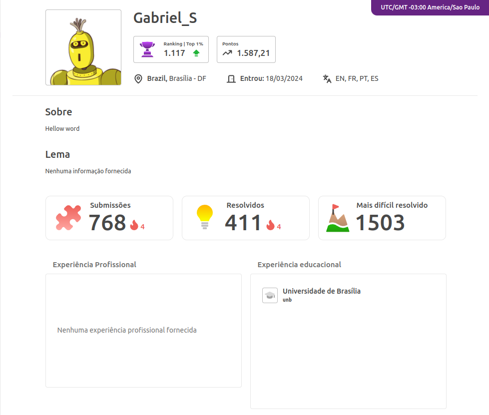
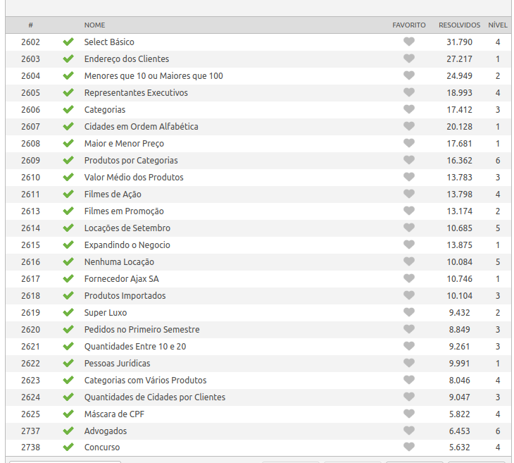
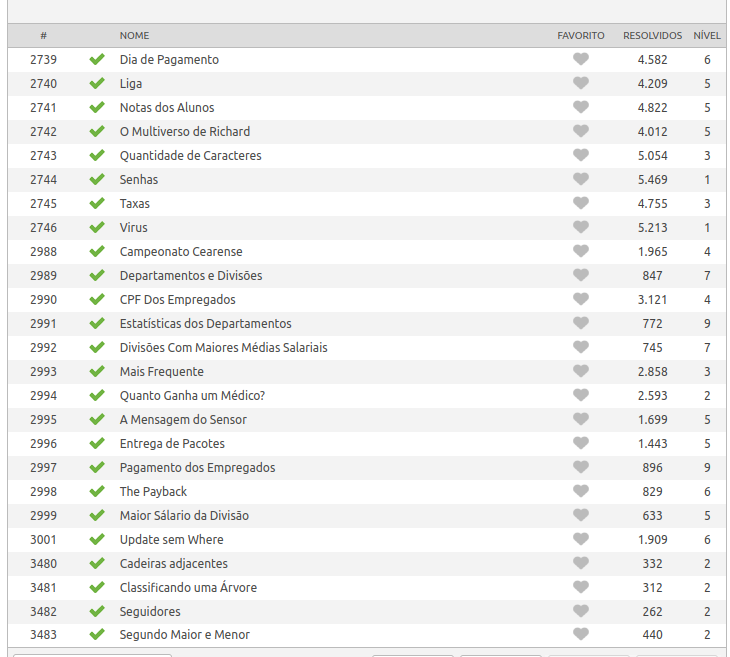

# 🎉 Bem-vindo ao meu Repositório SQL 🎉

  
  

# 📚 Problemas Beecrowd 📚

  

Os problemas de SQL no Beecrowd são desafios focados em consultas, manipulação e gerenciamento de dados. 💡 Eles testam sua habilidade de trabalhar com grandes conjuntos de dados e aplicar conhecimentos teóricos na prática. Além disso, são excelentes para aprimorar suas habilidades com bancos de dados relacionais! 🚀

🔗 [Veja meu perfil no Beecrowd!](https://judge.beecrowd.com/pt/profile/980945) 

  

# ✅ Todos os exercícios de SQL estão resolvidos! 📘 Use os códigos para estudar, mas por favor, não copie! 🙏📚
  🔗 [Veja os códigos feitos!]() 

  
  
  

---

# 🛠️ Soluções Implementadas a partir de Problemas Interessantes

💭 **Pensando em suas capacidades...**  
A partir dos problemas: 
| 📝 Problema | 📌 Status   |
|------------|-------------|
| 2989       | ✅ Resolvido |
| 2991       | ✅ Resolvido |
| 2992       | ✅ Resolvido |

# Criei uma base de dados fictícia para analisar diferentes capacidades e funções do SQL. Aqui estão os resultados! 🎯
🔗 [Veja a referência completa aqui](https://www.example.com)

---
